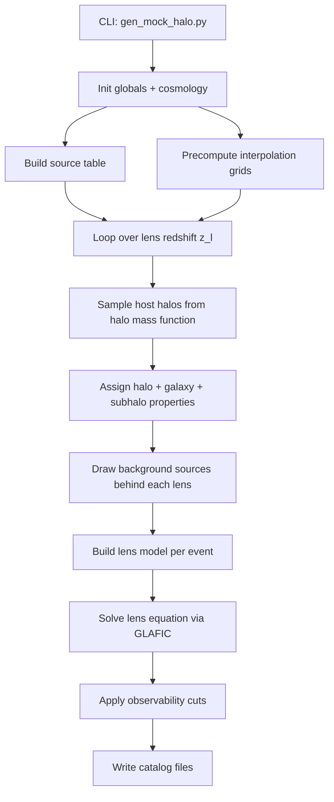

# SL-Hammocks Pipeline Workflow

This document describes how **SL-Hammocks** (Strong Lensing HAlo Model-based MOCK catalogS) goes from source and lens populations to a mock strong-lensing catalog. The main entry point is `gen_mock_halo.py`.

---

## High-level overview



**In one sentence:** sample lens halos (and subhalos) from a halo model, place background QSOs or SNe behind them, solve the lens equation for each trial, keep events that pass magnitude/separation/magnification cuts, and write structured catalog files.

---

## Entry point and configuration

Run:

```bash
pixi run python gen_mock_halo.py \
  --area=20000.0 --ilim=23.3 --zlmax=3.0 \
  --source=qso --prefix=qso_mock --solver=glafic --nworker=1
```

| Flag | Role |
|------|------|
| `--area` | Survey area [deg²] |
| `--ilim` | Observed magnitude limit |
| `--zlmax` | Maximum lens redshift |
| `--source` | `qso` or `sn` |
| `--prefix` | Output file prefix under `result/` |
| `--solver` | Lens-equation solver (`glafic`) |
| `--nworker` | Parallel workers (area split via joblib) |

`run_command_line()` in `gen_mock_halo.py` sets globals in `global_value.py` (cosmology, mass limits, magnitude flags, etc.), initializes K-correction splines, and loads galaxy SMHM parameters via `lens_gals.gals_init()`.

Default cosmology: **Planck18** via Colossus.

---

## Stage 1 — Source population

**Modules:** `source_tab.py`, `source_qso.py`, `source_sn.py`

### What it computes

A discrete **source table** of background objects:

- `m_tab` — intrinsic (absolute) magnitude
- `zs_tab` — source redshift
- `f_tab` — source type flag (QSO = 0; SNe types 1–5)

### How it computes

1. **`source_tab.make_srctab(mmax, fov, flag_type_min, flag_type_max, cosmo)`**
   - Grid in observed magnitude `m` (step 0.02 mag) and redshift `z` (step 0.01).
   - For each (m, z) bin and each source type, compute expected count:
     ```
     N_expected = area × dN/dz/dm_obs × dm × dz
     ```
   - Draw `Poisson(N_expected)` objects per bin.
   - Flatten into per-object arrays.

2. **Number density `dndzdmobs(m, z, flag_type, cosmo)`**
   - **QSO (`flag_type=0`):** Richards et al. luminosity function in absolute magnitude, converted with K-correction (`source_qso.kcor_ii`) and distance modulus (`source_qso.mtoma_qso`).
   - **SNe (`flag_type=1..5`):** Type-specific rates and LFs from `source_sn.py`, with band K-corrections from `data_Kcor/`.

3. **Volume element `calc_vol(z, cosmo)`**
   - Comoving volume per solid angle: `dV/dz/dΩ` [Mpc³/deg²], used for both source and lens number counts.

The source table is **not** tied to individual lenses yet. It is a pool of background objects sampled uniformly at random when a lens needs a source (`kk = random index into m_tab/zs_tab/f_tab`).

---

## Stage 2 — Lens population (setup)

**Modules:** `lens_halo.py`, `lens_subhalo.py`, `lens_gals.py`

Before the main loop, the code builds four 2D lookup tables (scipy `RegularGridInterpolator`) and saves them as `{prefix}_interp_*.npz`. Expensive GLAFIC / subhalo-MF calculations run once on a coarse grid; runtime queries are fast interpolations.

See [Precomputed interpolators](#precomputed-interpolators) below for what each table stores and how it is built.

### Host halo sampling

For each lens redshift slice `z_l` in `[zlmin, zlmax]` (step `dz=0.001`):

1. **Halo mass grid:** `MMh` from `10^log10Mh_min` to `10^log10Mh_max` (step dlogM = 0.001 dex).

2. **Expected halo count per mass bin:**
   ```
   NN_h = area × dN_halo/dz/dlnM × dlnM × dz
   ```
   via `lens_halo.dNhalodzdlnM_lens()` — Tinker08 mass function (M200c) × comoving volume.

3. **Poisson draw** → list of host halos at that z_l.

### Host halo properties

For each sampled host (`lens_halo.halo_properties_200c2vir`):

- Convert M200c → M_vir, r_vir, concentration (Diemer19 + lognormal scatter `sig_c`).
- Ellipticity and position angle (`solve_lenseq.gene_e_ang_halo`).

### Central galaxy

`lens_gals.galaxy_properties()` on host M_vir:

- Stellar mass from SMHM relation (`TYPE_SMHM`, default `true`).
- Hernquist scale radius from galaxy size model (`TYPE_GAL_SIZE`, default `vdW23`).
- Ellipticity, position angle, lognormal scatters.

### Subhalo population

`lens_subhalo.subhalo_mass_function()` per host:

- Subhalo masses from interpolated dn/dm table.
- Accretion masses, tidal truncation.
- Spatial positions from NFW density profile (`subhalo_distribute` + `xfunc` interpolator on μ(r)).
- Subhalo concentration, satellite galaxy properties (same galaxy pipeline with `g.params`).

---

## Precomputed interpolators

All interpolators are 2D grids over `(log10 mass, redshift)` wrapped in `lens_subhalo.create_interpolator()` → `RegularGridInterpolator`. Saved `.npz` files let you inspect or reuse the grids without rerunning setup.

### 1. `interp_bsrc_h` — host-halo source-plane boundary

**Built by:** `lens_halo.create_interp_bsrc_h()`  
**Saved as:** `{prefix}_interp_bsrc_h.npz` (`arr_0` = log10 M_h, `arr_1` = z, `arr_2` = table)

**What it stores:** Half-size of the source-plane sampling box [arcsec] for a host halo of given M_h at redshift z_l.

**How it is built (50×50 grid):**

1. For each (M_h, z_l), assign central-galaxy stellar mass (SMHM) and Hernquist scale radius.
2. Set up a GLAFIC lens: NFW host + Hernquist central (fixed e = 0.8).
3. Find image-plane radius where κ = 0.45 (`func_kapy_root`).
4. Find outer radius where |μ| = 1.5 (`func_magy_root`).
5. Convert that image radius to source-plane offset: `src_y = box_y − image_y` at z = zsmax.
6. Interpolate `src_y` for any (log10 M_h, z_l) at runtime.

**Used for:** Expected source count behind a host (`nn_src ∝ box_src²`) and uniform draw of (sx, sy) in `[-box_src, box_src]`.

### 2. `interp_bsrc_sh` — subhalo source-plane boundary

**Built by:** `lens_subhalo.create_interp_bsrc_sh()`  
**Saved as:** `{prefix}_interp_bsrc_sh.npz`

**What it stores:** Same as above, but for an isolated subhalo (+ satellite galaxy) of accretion mass M_sh at z_l.

**How it is built:** Same κ/μ boundary algorithm as `interp_bsrc_h`, but lens = NFW subhalo + Hernquist satellite. Grid: 50×50 over log10 M_sh and z.

**Used for:** Source placement and Poisson source counts per subhalo lensing trial.

### 3. `interp_dnsh` — subhalo number per host

**Built by:** `lens_subhalo.create_interp_dndmsh()` (first output)  
**Saved as:** `{prefix}_interp_dnsh_msh_acc_Mh.npz` (`grid_dnshp` inside)

**What it stores:** Subhalo mass function dn/dm_sh on a 1D mass axis, for each (log10 M_host, z_l) — shape `(n_acc, n_acc, n_bins−1)` with default n_bins = 100.

**How it is built:**

1. Grid over host masses and redshifts (default 30×30).
2. For each grid point, call `exnum_sh_oguri_w_macc_for_grid()` — Oguri-style subhalo model with accretion masses and tidal stripping.
3. Store dn/dm histogram and accretion-mass bins per host.

**Used for:** `subhalo_mass_function()` — Poisson draw of subhalo counts and masses per host halo.

### 4. `interp_msh_acc_Mh` — subhalo accretion masses

**Built by:** same `create_interp_dndmsh()` (second output)  
**Saved in:** same `{prefix}_interp_dnsh_msh_acc_Mh.npz` (`grid_msh_acc_Mhp`)

**What it stores:** Accretion-time subhalo mass M_acc aligned with each dn/dm bin, for the same (log10 M_host, z_l) grid.

**Used for:** Tidal truncation (`frac_sh_trunc = M_sh / M_acc`), subhalo concentration, satellite galaxy assignment, and subhalo lens model masses.

### Runtime use summary

```
interp_bsrc_h(log10 M_h, z_l)     → box_src [arcsec]     → source positions (host lensing)
interp_bsrc_sh(log10 M_sh_acc, z_l) → box_src [arcsec]   → source positions (subhalo lensing)
interp_dnsh + interp_msh_acc_Mh   → subhalo MF           → how many subhalos, what masses
```

---

## Stage 3 — Lensing events (main loop)

**Function:** `lens_judge_d_genmock(fov, zz_ar)` in `gen_mock_halo.py`

Parallelized over area chunks with `joblib.Parallel`.

### Per host halo — host-only lensing

For halos with ≥1 background source (Poisson draw from source density behind lens):

1. Pick random source from global table (`zs`, `ms`, `fs`).
2. Require `zs > z_l + 0.5×dz` (source must be behind lens).
3. Build **3-component lens model:**
   ```
   [NFW host, Hernquist central, external perturbation]
   ```
   Models: `anfw`, `ahern`, `pert` (large-scale shear from `solve_lenseq.set_shear(zs)`).

4. Compute Einstein radius: `solve_lenseq_glafic.calc_ein(zs, lens_par, cosmo)`.

5. If θ_E large enough, draw source position (sx, sy) uniformly in `[-box_src, box_src]` where `box_src = interp_bsrc_h(log10 M_h, z_l)`.

6. Call `storage_result(...)` → lens equation + cuts.

### Per subhalo — subhalo + host lensing

For each subhalo with sources behind it:

1. Check external convergence from host: `kappa_ext_from_host_halo < kext_zs_lim`.
2. Build **5-component lens model:**
   ```
   [NFW subhalo, Hernquist satellite, NFW host (offset), Hernquist central (offset), perturbation]
   ```
3. Same source draw, Einstein radius, position sampling (using `interp_bsrc_sh`).
4. Store `frac_sh_trunc = m_sh / m_sh_acc` (tidal truncation fraction).

---

## Coordinate assignment (source + lens components)

**Important:** SL-Hammocks does **not** assign absolute sky coordinates (RA/Dec). Each lensing event lives in a **local 2D plane** in **arcseconds**, centered on the primary lens. Survey `--area` only sets **how many** halos/sources enter the mock — not where on the celestial sphere each event sits.

All positions passed to GLAFIC and written to the catalog are **(x, y) offsets in this local frame**.

### Coordinate frame

```
        +y (arcsec)
         |
         |    source (sx, sy)
         |       ·
    -----+----- (0,0) = primary lens center
         |
         +x
```

- **Host-only events:** origin = host halo center = central galaxy center.
- **Subhalo events:** origin **recentered on the subhalo**; host + central appear offset.

Physical sizes (Mpc/h) convert to arcsec via angular diameter distance at lens redshift:

```
convert_t = 206264.8 / D_A(z_l)    [arcsec per Mpc/h]
```

(same factor used for subhalo positions and galaxy scale radii).

### Source position on the “sky” (local source plane)

For each lensing trial, after picking background source `(zs, ms, fs)` from the global table:

1. Look up source-plane box half-width `box_src` [arcsec] from `interp_bsrc_h` (host) or `interp_bsrc_sh` (subhalo).
2. Draw uniformly in a square:
   ```
   sx = Uniform(−box_src, +box_src)
   sy = Uniform(−box_src, +box_src)
   ```
3. Reject if outside Einstein-scaled window:
   ```
   |sx|, |sy| < θ_E × (rt_range + 1)
   ```
   (`rt_range` default 4 → keeps sources near strong-lensing zone.)

`box_src` comes from precomputed κ/μ boundary (see [Precomputed interpolators](#precomputed-interpolators)) — not random; it scales with lens mass. Source `(sx, sy)` is **relative to the same origin as the lens model**, in the source plane [arcsec].

### Host-halo lensing — component positions

Three components, **all centered at (0, 0)**:

| Component | Model | (x, y) | Notes |
|-----------|-------|--------|-------|
| Host halo | NFW `anfw` | (0, 0) | M_vir, c, e_h, PA |
| Central galaxy | Hernquist `ahern` | (0, 0) | Co-located with host; M_*, scale radius tb [arcsec] |
| Line-of-sight perturbation | `pert` | (0, 0) | External shear from `set_shear(zs)` |

Galaxy sits on top of halo center — no separate offset draw. Ellipticity and PA differ per component but share origin.

### Subhalo lensing — nested assignment

**Step 1 — subhalo position inside host (physical space)**

`subhalo_distribute(r_vir, c, e_h, PA_h, xfunc, n)`:

1. Draw radius from host NFW density profile (invert enclosed mass μ(r) via `xfunc`).
2. Place point on 2D ellipse at that radius (`random_points_on_elip_2d`).
3. Returns `(x_sh, y_sh)` in **Mpc/h**, host-centric, host at center.

**Step 2 — convert to arcsec**

```
tx = x_sh × convert_t
ty = y_sh × convert_t
```

**Step 3 — recenter lens model on subhalo**

Origin moves to subhalo. Host was at (0,0) in host frame → now at **(−tx, −ty)**:

| Component | (x, y) | Role |
|-----------|--------|------|
| Subhalo NFW | (0, 0) | Primary lens |
| Satellite Hernquist | (0, 0) | Co-located with subhalo |
| Host NFW (mass = M_host − M_sub) | (−tx, −ty) | Tidal-stripped host, offset |
| Central Hernquist | (−tx, −ty) | Co-located with host center |
| Perturbation | (0, 0) | External shear |

Satellite always shares subhalo center; central always shares host center.

Before lensing, `kappa_ext_from_host_halo(tx, ty, ...)` checks host convergence at subhalo sky position — events with κ_ext too high are dropped.

### What the catalog stores

From `dump_result()` — lens lines use GLAFIC `(xl, yl)` directly:

- **Host event:** host + central at (0, 0); subhalo/satellite lines = −1 (absent).
- **Subhalo event:** subhalo + satellite at (0, 0); host + central at (−tx, −ty) — e.g. catalog example with host at (11.79″, −11.99″).

Source columns `xs`, `ys` and image positions in `log.dat` are in the **same arcsec frame** as the primary lens (subhalo or host at origin).

### Summary diagram — subhalo event

```
Host-centric view (before recenter):          GLAFIC frame (after recenter):

        host (0,0)                              subhalo (0,0) ← origin
       /    |    \                               satellite (0,0)
      /     · subhalo (tx,ty)                    source (sx,sy) near origin
     /                                    host + central at (−tx,−ty)
```

---

## Stage 4 — Lens equation and image properties

**Modules:** `solve_lenseq.py`, `solve_lenseq_glafic.py`

### What it computes

For each (lens, source) trial:

| Quantity | Meaning |
|----------|---------|
| Image positions (x, y) | Lensed image locations [arcsec] |
| Magnification μ | Per image |
| Time delay | Per image [days] |
| κ, γ₁, γ₂ | Convergence and shear at each image |
| κ* | Stellar convergence from galaxy component |
| nim | Number of images |
| sep | Max pairwise image separation [arcsec] |
| mag, magmax | Magnification used for bias + peak μ |
| fr | Flux ratio μ₂/μ₁ (2–3 image systems) |
| ein | Einstein radius [arcsec] |

### How it computes

1. **`solve_lenseq_glafic.solve_lenseq_glafic()`**
   - Initialize GLAFIC grid sized by `ein × (rt_range + 3)`.
   - Register each lens component with `glafic.set_lens()`.
   - Solve: `glafic.point_solve(zs, sx, sy)` → image list.
   - Per image: `glafic.calcimage()` → κ, γ₁, γ₂; second GLAFIC pass for κ*.

2. **`solve_lenseq.calc_image()`** post-processes:
   - For 5-component (subhalo) models, filter images too far from subhalo center (`filter_for_subhalos_imgs`).
   - Sort magnifications, compute separation, flux ratio, magnification-bias metric (`flag_mag`, default 3rd-brightest image).

3. **Observed magnitudes:**
   ```
   m_obs  = m_intrinsic − 2.5 log10(μ_bias)
   m_min  = m_intrinsic − 2.5 log10(μ_max)
   ```

---

## Stage 5 — Event selection (catalog membership)

**Function:** `storage_result()` in `gen_mock_halo.py`

An event is kept if `flag_out > 0`:

| Criterion | `flag_out` bit | Condition |
|-----------|----------------|-----------|
| Multiply imaged | +1 | `nim > 1`, `m_obs ≤ ilim`, `sepmin ≤ sep ≤ sepmax`, `fr ≥ frlim` |
| High magnification | +2 | `m_min ≤ ilim` and `μ_max ≥ maglim` (default 3×) |

`flag_out` values: 1 = multi-image only, 2 = high-μ only, 3 = both.

Only passing events append to result lists: lens params, source params, images, κ/γ, event summary.

---

## Stage 6 — Write output files

**Functions:** `dump_result()`, `dump_setup()` in `gen_mock_halo.py`

After all workers finish, per-chunk event lists merge (`chain.from_iterable`) and write under `result/{prefix}_*`. Tuple dumps (`*_tup.txt`) go out first; formatted catalogs via `dump_result()`.

---

## Module map

```
gen_mock_halo.py          Orchestrator: CLI, loops, parallel, I/O
global_value.py           Constants and run-time globals
source_tab.py             Source number counts + table generation
source_qso.py / source_sn.py   LF, K-corrections, magnitude conversions
lens_halo.py              Host halo MF, properties, κ_ext, bsrc interpolator
lens_subhalo.py           Subhalo MF, positions, truncation, bsrc interpolator
lens_gals.py              Galaxy SMHM, sizes, Hernquist parameters
solve_lenseq.py           Image post-processing, shear, ellipticity helpers
solve_lenseq_glafic.py    GLAFIC wrapper: init, solve, Einstein radius
```

---

## Physical models summary

| Component | Profile | Key inputs |
|-----------|---------|------------|
| Host halo | NFW (`anfw`) | M_vir, c, e, PA |
| Subhalo | NFW (`anfw`) | M_acc, c, position in host |
| Central / satellite galaxy | Hernquist (`ahern`) | M_*, scale radius, e, PA |
| Line-of-sight structure | Perturbation (`pert`) | External shear + κ |

Cosmology, mass functions, and concentration–mass relations come from **Colossus**. Lens equation solved by **GLAFIC**.

---

## Data flow (source → lens → catalog)

```
Source LF + K-corrections
        ↓
  source table (m, z, type)  ←── random draw per trial
        ↓
Halo MF → host properties → subhalo MF → galaxy properties
        ↓
  lens_par + srcs_par [zs, sx, sy]
        ↓
  GLAFIC: θ_E, images, κ, γ
        ↓
  Observability cuts (mag, sep, μ)
        ↓
  result.dat / log.dat / tup files
```

---

## Final data products

End product of one `gen_mock_halo.py` run: **mock catalog of gravitationally lensed QSOs or SNe** over the requested survey area, filtered to observable strong-lensing events.

### What you get

Each **lensing event** is one background source (QSO or SN) that passed selection cuts when lensed by a host halo and/or subhalo. For every kept event the catalog records:

- **Source:** redshift, intrinsic magnitude, lens-plane position (x, y)
- **Observation:** number of images, brightest/faintest observed magnitude, image separation, flux ratio, Einstein radius
- **Lens model:** up to five mass components (subhalo, satellite, host, central galaxy, line-of-sight perturbation) with mass, redshift, position, ellipticity, and profile parameters
- **Images (log file):** per-image position, magnification, time delay, convergence, shear, stellar κ*

Events are tagged by `flag_out`: multiply imaged (bit 1), high magnification (bit 2), or both (3). Subhalo-lensed events also carry `frac_sh_trunc`.

### Primary vs auxiliary files

| Tier | Files | Role |
|------|-------|------|
| **Science** | `{prefix}_result.dat`, `{prefix}_log.dat` | Mock lensing catalog for analysis |
| **Reproducibility** | `{prefix}_setup.dat` | Exact run parameters |
| **Setup cache** | `{prefix}_interp_*.npz` | Interpolation grids (not science output) |
| **Python reload** | `{prefix}_*_tup.txt` | Raw tuple dumps for scripting |

Typical use: read `result.dat` for event + lens demographics; read `log.dat` for image-level lensing diagnostics.

### Output file reference

Column definitions, units, `flag_out` values, lens component indices, and Python reload examples:

**[result/catalog.md](../result/catalog.md)**

---

## References

- SL-Hammocks paper: [Abe et al. 2025, OJAp 8, 8](https://ui.adsabs.harvard.edu/abs/2025OJAp....8E...8A/abstract)
- Example catalogs: [LSST data_public / SL_hammocks_catalogs](https://github.com/LSST-strong-lensing/data_public/tree/main/SL_hammocks_catalogs)
